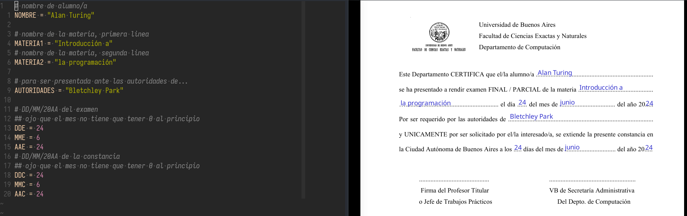

constancia - generador de constancia de examen
---

- verificar/instalar dependencias: `make`, `wget`, `python3`, `xournalpp`
- modificar `datos.py` segun corresponda
- correr `make` (esto va a descargar el archivo `base/constancia-examen.pdf`)
- `constancia.pdf` listo

